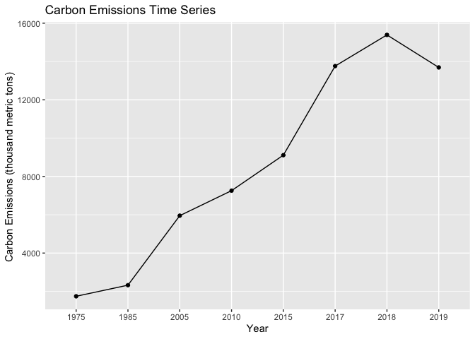
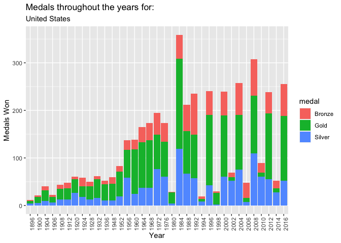
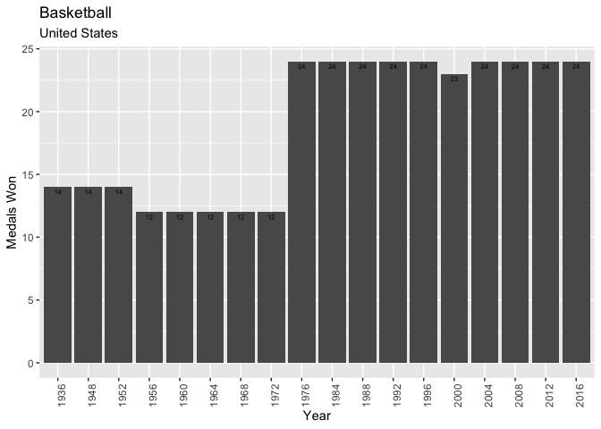
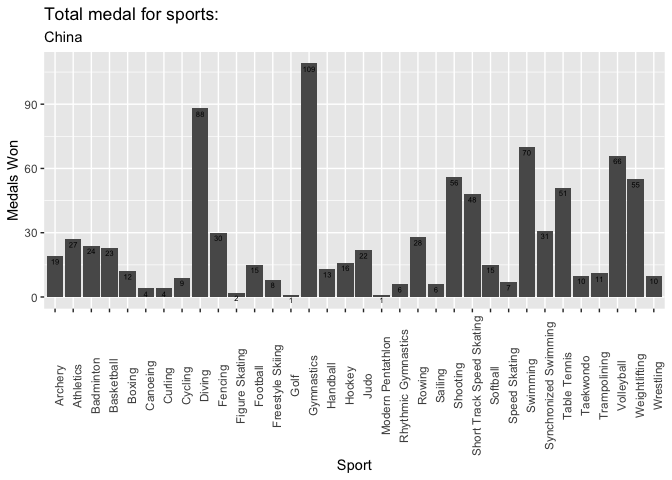

<!-- README.md is generated from README.Rmd. Please edit that file -->

# genworld

<!-- badges: start -->

[](https://lifecycle.r-lib.org/articles/stages.html#experimental)
[](https://CRAN.R-project.org/package=genworld)
[](https://github.com/christinasherpa24/SONIC/actions/workflows/R-CMD-check.yaml)
<!-- badges: end -->

## Team Members

Christina Sherpa, Sariah Akhdar, Naomi Giancola

## Purpose

The purpose of this package is to provide information about different
countries around the world. It includes data on various aspects of each
country, such as the LGBTQ acceptance rate, COVID statistics, and
Olympic participation. Users can use the package’s functions to search
for specific countries and learn more about them.

## Target

The target audience for this package is anyone who is interested in
facts about the world. Specifically, we are aiming to appeal to people
who play games such as the Worldle and Globle. Additionally, this
package can be used by people who are looking for information from all
countries for a specific issue or issues surrounding a region
(neighboring countries).

## Installation

You can install the development version of genworld like so:

``` r
# install.packages("devtools")
devtools::install_github("christinasherpa24/genworld")
```

## Included Datasets

We have a total of 8 datasets in this package:

-   `carbon_emissions` : Carbon emissions for every country from 1974 on
    wards
-   `historical_olympics` : Historical Olympics data from 1896-2016
-   `lgbtq_acceptance` : GAI (2,750 surveys conducted over 30 years) for
    countries
-   `country_borders` : Information about countries that boarder each
    other
-   `jewish_deaths` : Information pertaining to Jewish deaths in Europe
    from the Holocaust
-   `world_population` : Information related to world population over
    the years for each country/region
-   `covid_vaccinations` : Daily COVID vaccines administered in each
    country from 2020-onwards
-   `covid_hospitalizations` : Daily COVID hospitalisations in each
    country from 2020-onwards

## Examples

Here are examples of how to run our functions and what they do.

This is an example of the function **bordering_countries**. It allows
users to enter a country name, for example “Albania” and then it will
return a list of all the countries that border that country.

The function **carbon_timeseries** takes in a country name such as
“Nepal” and returns a line graph on the trend of carbon emissions
throughout the years and also lists out the total carbon emissions.

``` r
library(genworld)
carbon_timeseries("Nepal")
#> [[1]]
```



    #> 
    #> [[2]]
    #> [1] 69231

``` r
library(genworld)
athlete_info("Nesar Ahmad Bahawi")
#>                 name                         event       games    city medal
#> 1 Nesar Ahmad Bahawi Taekwondo Men's Featherweight 2008 Summer Beijing  <NA>
#> 2 Nesar Ahmad Bahawi  Taekwondo Men's Welterweight 2012 Summer  London  <NA>
```

``` r
library(genworld)
team_medal_info("United States")
#> [[1]]
```



    #> 
    #> [[2]]
    #> [1] 105

``` r
library(genworld)
sport_medal_info("United States", "Basketball")
#> [[1]]
```



    #> 
    #> [[2]]
    #> [1] 18

``` r
library(genworld)
team_sport_medal_info("China")
#> [[1]]
```



    #> 
    #> [[2]]
    #> [1] 34

Naomi’s

This is an example of the function **countries_lgbt_acceptance**. It
allows users to enter a country name, for example “France” and then it
will outputthe GAI for that country, which indicates the acceptance of
LGBTQ+ people

``` r
library(genworld)
countries_lgbt_acceptance("France")
#>   country_name  gai
#> 1       France 7.73
```

This is an example of the function **lgbt_acceptance_graph**. It allows
users to enter a country name, for example “France” and then it will
output the graph of the GAI compared to the GAI’s of other countries in
the world.

\*Note: The graph is made using plotly which does not appear in ReadMe.
To see the graph, please see the help file (?lgbt_acceptance_graph) and
run the examples.

``` r
library(genworld)
lgbt_acceptance_graph("France")
#> [[1]]
#> [1] 7.73
#> 
#> [[2]]
```

This is an example of the function **bordering_countries**. It allows
users to enter a country name, for example “Albania” and then it will
return a list of all the countries that border that country.

``` r
bordering_countries("Albania")
#>   xcountry_code country_name country_border_code country_border_name
#> 1            AL      Albania                  GR              Greece
#> 2            AL      Albania                  ME          Montenegro
#> 3            AL      Albania                  MK     North Macedonia
#> 4            AL      Albania                  RS              Serbia
```

This is an example of the function **graph_jewish_killed**. It allows
users to enter a country name, for example “France” and then it will
return a bar chart of Jewish people killed during the Holocaust compared
to the amount of Jewish people alive before the Holocaust.

\*Note: The graph is made using plotly which does not appear in ReadMe.
To see the graph, please see the help file (?graph_jewish_killed) and
run the examples.

``` r
library(genworld)
graph_jewish_killed("France")
#> [[1]]
#> [1] 76000
#> 
#> [[2]]
```

The function **country_population** takes in a country name that a user
inputs, and returns the population of the chosen country in 2000,
2010,2015 and 2022.

``` r
library(genworld)
country_population('Algeria')
#> # A tibble: 1 × 5
#>   country_territory population_2022 population_2015 population_2010 population…¹
#>   <chr>                       <dbl>           <dbl>           <dbl>        <dbl>
#> 1 Algeria                  44903225        39543154        35856344     30774621
#> # … with abbreviated variable name ¹​population_2000
```

The function **daily_vaccinations_function** that takes in a country as
an input and outputs the number of doses administered for the country
chosen from 2020-present

``` r
library(genworld)
daily_vaccinations_function('Algeria')
#> # A tibble: 584 × 3
#>    location date       daily_vaccinations
#>    <chr>    <date>                  <dbl>
#>  1 Algeria  2021-01-29                 NA
#>  2 Algeria  2021-01-30                 30
#>  3 Algeria  2021-01-31               1889
#>  4 Algeria  2021-02-01               2509
#>  5 Algeria  2021-02-02               2819
#>  6 Algeria  2021-02-03               3005
#>  7 Algeria  2021-02-04               3129
#>  8 Algeria  2021-02-05               3217
#>  9 Algeria  2021-02-06               3748
#> 10 Algeria  2021-02-07               3748
#> # … with 574 more rows
```

## Package Proposal

We intend to create a package that will allow users to get information
about a variety of issues for specific countries. So far, we have
information about geography (bordering countries), carbon emissions, and
population (from 2000-2022). We plan to add much more information such
as women’s rights which can include aspects such as a women’s right to
vote or access to abortion as well as LGBTQ+ matters.
